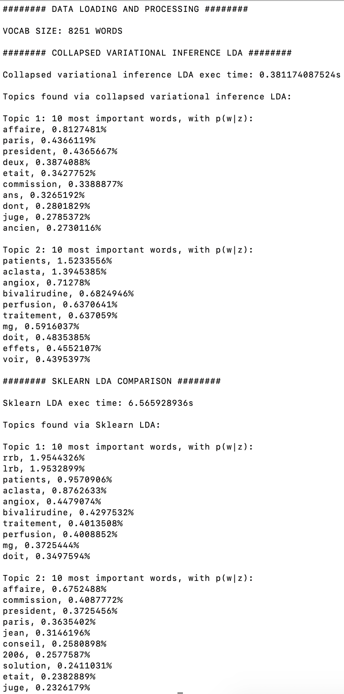

# Easy-to-use collapsed variational bayesian inference for Latent Dirichlet Allocation (LDA) implementation

Simple interface to test a LDA **[1]** implementation based on Collapsed Variational Bayesian (cvb) Inference **[2]**. Mainly thought to be tested on 'toy' examples, and easely compared to the Sklearn LDA implementation **[3]**, which is based on Stochastic Variational Inference **[4]**.

This program is based on the CVB-LDA module written by David Andrzejewski **[5]**, which must be installed before any test. **Warning:** This module is for the moment written for **Python 2**, we are working on a Python 3-compatible version of it.

See requirements.txt for other libraries requirements.

## Run the program:

You can run the program thanks to the command: 

'python cvb_LDA.py $text_file_path $language $nb_topics $nb_words_per_topic ${optional}comparison ${optional}alpha ${optional}beta ${optional}max_iter ${optional}tolerance'

Some parameters explanations: 

* 'text_file_path' (str): path to the file containing the documents to analyze (format: one document per line, exactly one whitespace between each token)
* 'language' (str):used to process input text (remove stopwords): can be 'french' or 'english'
* 'nb_topics' (int): number of topics the LDA algorithm will consider
* 'nb_words_per_topic' (int): the number of words which will be output linked to each topic
* {optional}comparison (bool): comparison with the Sklearn LDA algorithm ? (default= 'true')
* {optional}alpha (float): cvb LDA alpha parameter (default = 0.1)
*  {optional}beta (float): cvb LDA beta parameter (default = 0.1)
*   {optional}nb_max_iter (int): cvb LDA max number of iterations (default = 100)
*   {optional}tolerance (int): cvb LDA tolerance criterion (default = 0.001)

## Output format:

Output the nb_words_per_topic most representative words of each topic (the number of topics being equal to nb_topics).

Script example, with the french sequoia-corpus **[6]** (post-processed: only sentences and no parsing information), 2 topics and 10 words shown for each topic:

**Command**:

'python cvb_LDA.py sequoia-corpus_sent french 2 10'

**Output**:

The two main topics of the sequoia corpus are pointed out: medical articles and political / judicial ones. 
Qualitatively, cvb LDA and Sklearn LDA give approximately the same results. Interestingly (and strangely), cvb LDA runs quite faster than Sklearn LDA. 

## References:

**[1] Latent Dirichlet Allocation**
Blei, D. M., Ng, A. Y., and Jordan, M. I. 
Journal of Machine Learning Research (JMLR), 3, Mar. 2003, 993-1022.

**[2] A Collapsed Variational Bayesian Inference Algorithm for Latent Dirichlet Allocation**
Teh Y.W., Newman D., and Welling, M.
Advances in Neural Information Processing Systems (NIPS) 19, 2007.

**[3] Sklearn LDA implementation, link**:
<https://scikit-learn.org/stable/modules/generated/sklearn.decomposition.LatentDirichletAllocation.html#examples-using-sklearn-decomposition-latentdirichletallocation>

**[4] Stochastic Variational Inference**, Matthew D. Hoffman, David M. Blei,
Chong Wang, John Paisley, 2013

**[5] David Andrzejewski CVB-LDA code and installation procedures**: <https://github.com/davidandrzej/cvbLDA>

**[6] Sequoia Fr v6.0 database, link**:
<https://www.rocq.inria.fr/alpage-wiki/tiki-index.php?page=CorpusSequoia>
